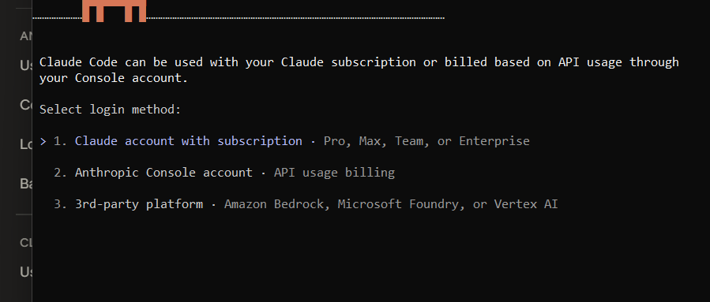
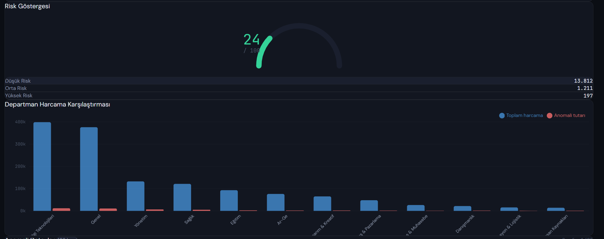
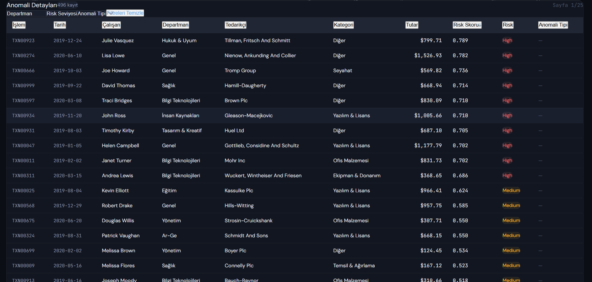
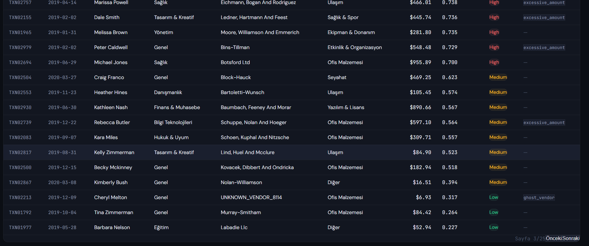
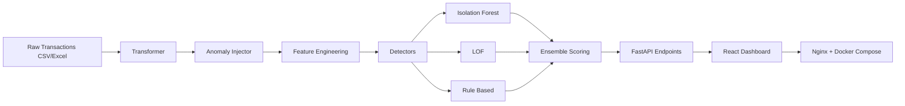
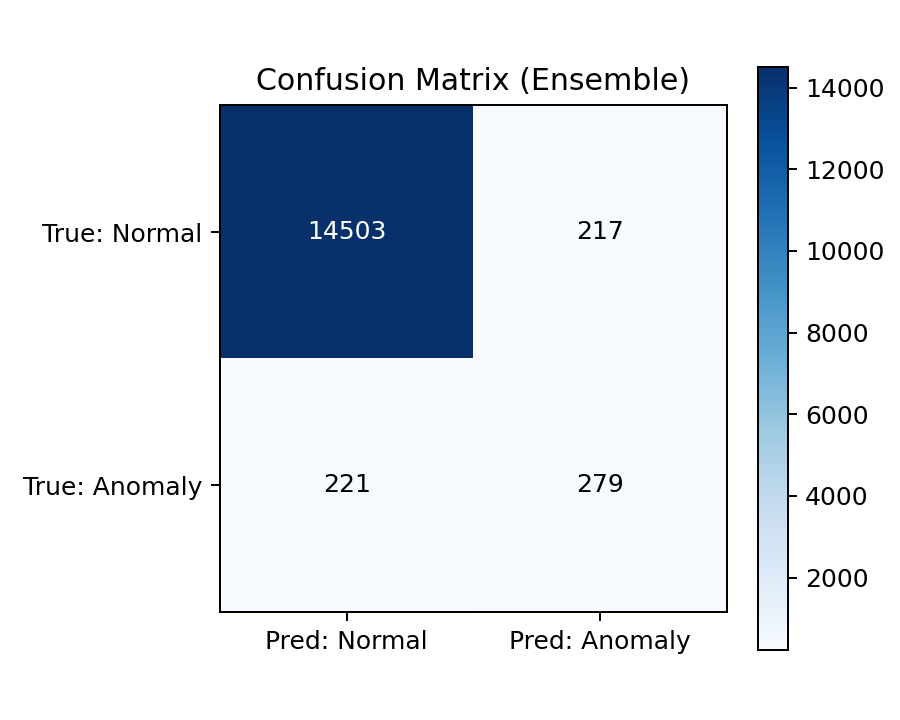

# ExpenseGuard

ExpenseGuard, kurumsal harcama verisinde anomali tespitini FastAPI + React tabanli bir analiz paneli ile uctan uca sunan bir platformdur.


## Demo







## Proje Motivasyonu

"Finans denetcilerinin saatlerce Excel'de aradigi anomalileri saniyeler icinde tespit eder"

## Mimari



## Teknoloji Stack

| Layer | Technology | Purpose |
|---|---|---|
| Backend API | FastAPI, Uvicorn | REST API and data serving |
| ML / Data | Pandas, NumPy, Scikit-learn | Feature engineering and anomaly scoring |
| Frontend | React, Vite, Recharts | Dashboard and visual analytics |
| Infra | Docker, Docker Compose, Nginx | Containerization and reverse proxy |
| Data Format | CSV / Excel | Batch transaction ingestion |

## Kurulum

### 1) Python only (Backend)

```bash
python -m venv .venv
.venv\Scripts\activate
pip install -r requirements.txt
python backend/main.py
```

Backend: `http://localhost:8000`

### 2) Node only (Frontend)

```bash
cd frontend
npm install
npm run dev
```

Frontend (dev): `http://localhost:5173`

### 3) Docker (recommended)

```bash
docker-compose up --build
```

Frontend (Nginx): `http://localhost:3000`  
Backend API: `http://localhost:8000`

## Kullanim

1. Uygulamayi baslatin (`docker-compose up --build` onerilir).
2. UI uzerinden CSV/Excel dosyasi yukleyin.
3. `Dashboard`, `Anomalies`, `Departments` ve `Timeline` gorunumlerinden analiz yapin.
4. API metriklerini `GET /api/metrics` ile cekin.

## Veri Seti

Built on transaction patterns from the Sparkov Credit Card Transaction Generator (CC0 License), transformed into a corporate expense format with 8 departments, 9 expense categories, and 6 custom anomaly injection types.

## Model Performansi

> Bu tabloyu `GET /api/metrics` ciktisina gore guncelleyebilirsiniz.

| Detector | Precision | Recall | F1 |
|---|---:|---:|---:|
| Isolation Forest | TBD | TBD | TBD |
| LOF | TBD | TBD | TBD |
| Rule Based | TBD | TBD | TBD |
| Ensemble | 0.5625 | 0.5580 | 0.5602 |

**Confusion Matrix (Ensemble)**  


|              | Predicted Normal | Predicted Anomaly |
|---|---:|---:|
| Actual Normal  | 14503 | 217 |
| Actual Anomaly | 221 | 279 |

## Anomali Tipleri (6)

1. **duplicate_expense**: Ayni harcamanin tekrar edilmesi (cift fatura benzeri durum).
2. **excessive_amount**: Grup ortalamasinin belirgin sekilde ustunde tutar.
3. **weekend_expense**: Hafta sonu olusan supheli harcama davranisi.
4. **split_transaction**: Buyuk harcamanin esik altina bolunmesi.
5. **ghost_vendor**: Bilinmeyen veya kayit disi tedarikciye odeme.
6. **off_season**: Donem/mevsim ile uyumsuz kategori harcamasi.

## API Endpoints

| Method | Endpoint | Description |
|---|---|---|
| GET | `/api/health` | Health check |
| POST | `/api/upload` | Upload CSV/Excel and run full pipeline |
| GET | `/api/dashboard` | KPI summary and risk distribution |
| GET | `/api/anomalies` | Paginated anomaly list with filters |
| GET | `/api/anomalies/{transaction_id}` | Single transaction detail |
| GET | `/api/departments` | Department based anomaly analytics |
| GET | `/api/timeline` | Time series anomaly trend |
| GET | `/api/metrics` | Precision/Recall/F1 and confusion matrix |

## Proje Yapisi

```text
ExpenseGuard/
|-- backend/
|   |-- api/
|   |   `-- routes.py
|   |-- detectors/
|   |   |-- isolation_forest.py
|   |   |-- lof_detector.py
|   |   |-- rule_based.py
|   |   `-- ensemble.py
|   |-- pipeline/
|   |   |-- transformer.py
|   |   |-- injector.py
|   |   `-- feature_eng.py
|   |-- tests/
|   `-- main.py
|-- frontend/
|   |-- src/
|   |   |-- components/
|   |   |-- api/
|   |   `-- App.jsx
|   |-- Dockerfile
|   `-- nginx.conf
|-- data/
|   |-- raw/
|   `-- processed/
|-- docker-compose.yml
|-- requirements.txt
`-- README.md
```


